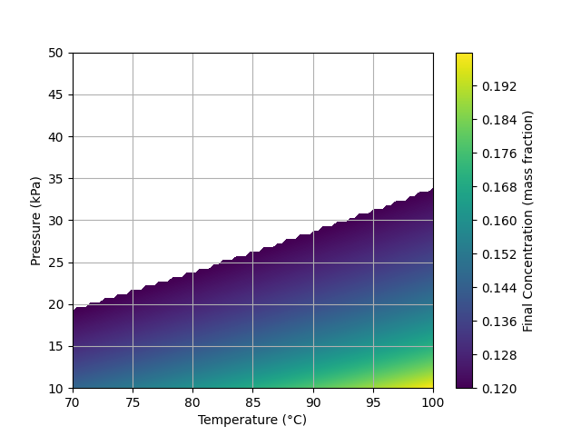
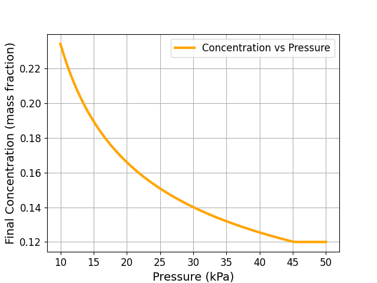
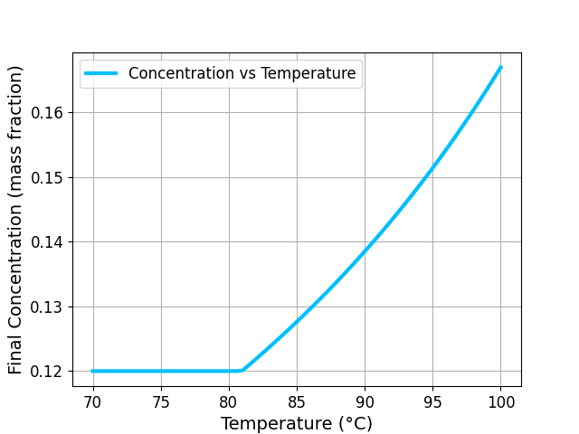

# CHN-302 Condensed Milk Modeling
Numerical Modeling and Optimization of Evaporated and Condensed Milk Production - [Final_Report.pdf](https://github.com/9bit-Jedi/chn302-cond-milk-modellilng/blob/main/Final%20report.pdf)

## Introduction & Objectives

Evaporated and condensed milk are essential products in the dairy industry, widely used for long-term storage, transport, and culinary applications. Their production involves removing a portion of water from raw milk using thermal evaporation under controlled conditions.

The primary objectives of this study are:

* To develop a numerical model of the milk evaporation process.
* To analyze effect of temperature, pressure on evaporation rate and final concentration.
* To optimize process parameters for improved product quality and reduce energy requirement.

Here’s a clean version with **titles and equations**, including **key notations** for clarity:


## Governing Equations

1. Mass Balance (Solids)

## Governing Equations

1. **Mass Balance (Solids)**  
```
ṁ_feed * X₀ = ṁ_concentrate * X_final
```

2. **Energy Balance**  
```
Q = ṁ_steam * λ_steam = ṁ_vapor * λ_solution + ṁ_feed * c_p * (T_solution - T_inlet)
```

3. **Heat Transfer Equation**  
```
Q = U * A * ΔT_LM   (kW)
```

4. **Vapor Generation Rate**  
```
ṁ_vapor = (U * A * ΔT_LM) / λ_solution
```

5. **Final Solids Concentration**  
```
X_final = X₀ / [1 - (ṁ_vapor / ṁ_feed)]
```

6. **Boiling Point Elevation**  
```
ΔT_b = K_b * m * i
```

7. **Antoine Equation (Boiling Point from Pressure)**  
```
T_boil = B / (A - log₁₀(P_mmHg)) - C
```
where  
`P_mmHg = P_kPa * 7.50062`  
`A = 8.07131`, `B = 1730.63`, `C = 233.426`


## Numerical Results

The concentration ranged from **0.12** (which is the assumed initial solid concentration based on the data in the current literature) to approximately **0.199**. Data suggests it is optimal solid content for condensed milk available in markets. Reduction in pressure below a certain limit decreases concentration, while increasing temperature steadily improves it.


### Contour Plot

## Key Insights

### Temperature

* Evaporation improves significantly above **80 °C**.
* This is a common and efficient industrial setting.

### Pressure

* Lower pressures enhance results, but gains slow below **15 kPa** due to high energy costs.


### Pressure vs Concentration


### Temperature vs Concentration

## Optimization Tips

- Best results come from using the highest safe temperature and the lowest practical pressure.
- There’s a sensitive zone in the temperature-pressure space where even small changes in settings lead to big changes in output concentration. This is a crucial area for
fine-tuning.
