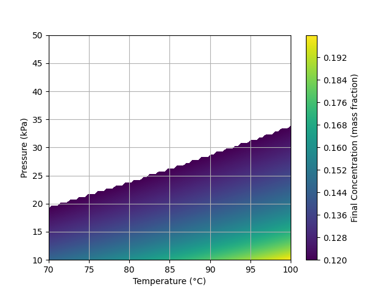
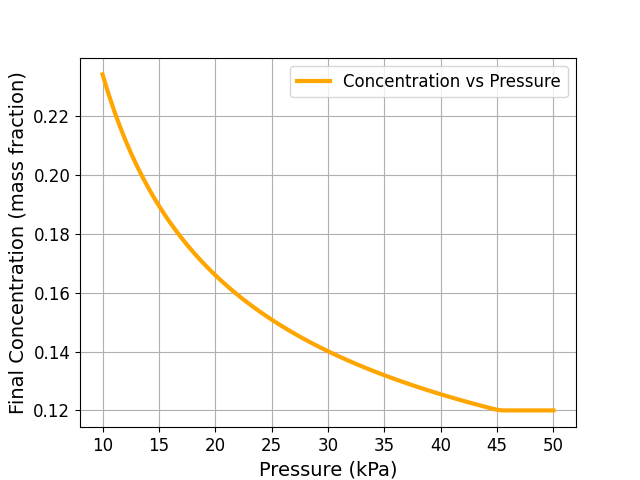
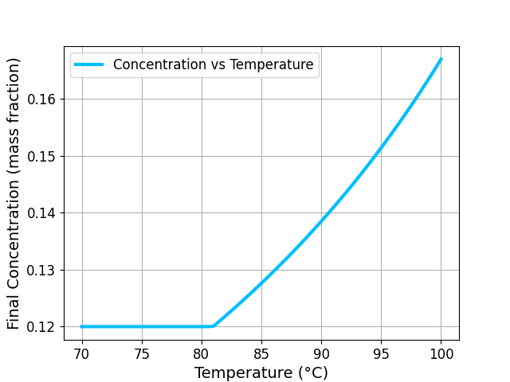

# CHN-302 Condensed Milk Modeling
Numerical Modeling and Optimization of Evaporated and Condensed Milk Production - [Final Report](Final_Report.pdf)

## Introduction & Objectives

Evaporated and condensed milk are essential products in the dairy industry, widely used for long-term storage, transport, and culinary applications. Their production involves removing a portion of water from raw milk using thermal evaporation under controlled conditions.

The primary objectives of this study are:

* To develop a numerical model of the milk evaporation process.
* To analyze effect of temperature, pressure on evaporation rate and final concentration.
* To optimize process parameters for improved product quality and reduce energy requirement.

Here’s a clean version with **titles and equations**, including **key notations** for clarity:


## Governing Equations

1. Mass Balance (Solids)

```latex
\dot{m}_{\text{feed}} \cdot X_0 = \dot{m}_{\text{concentrate}} \cdot X_{\text{final}}
```
2. Energy Balance

```latex
Q = \dot{m}_{\text{steam}} \cdot \lambda_{\text{steam}} = \dot{m}_{\text{vapor}} \cdot \lambda_{\text{solution}} + \dot{m}_{\text{feed}} \cdot c_p \cdot (T_{\text{solution}} - T_{\text{inlet}})
```
3. Heat Transfer Equation

```latex
Q = U \cdot A \cdot \Delta T_{\text{LM}} \quad \text{(kW)}
```
4. Vapor Generation Rate

```latex
\dot{m}_{\text{vapor}} = \frac{U \cdot A \cdot \Delta T_{\text{LM}}}{\lambda_{\text{solution}}}
```
5. Final Solids Concentration

```latex
X_{\text{final}} = \frac{X_0}{1 - \left(\frac{\dot{m}_{\text{vapor}}}{\dot{m}_{\text{feed}}}\right)}
```
6. Boiling Point Elevation

```latex
\Delta T_b = K_b \cdot m \cdot i
```
7. Antoine Equation (Boiling Point from Pressure)

```latex
T_{\text{boil}} = \frac{B}{A - \log_{10}(P_{\text{mmHg}})} - C
```

## Numerical Results

The concentration ranged from **0.12** (which is the assumed initial solid concentration based on the data in the current literature) to approximately **0.199**. Data suggests it is optimal solid content for condensed milk available in markets. Reduction in pressure below a certain limit decreases concentration, while increasing temperature steadily improves it.


### Contour Plot

## Key Insights

### Temperature

* Evaporation improves significantly above **80 °C**.
* This is a common and efficient industrial setting.

### Pressure

* Lower pressures enhance results, but gains slow below **15 kPa** due to high energy costs.


### Pressure vs Concentration


### Temperature vs Concentration

## Optimization Tips

- Best results come from using the highest safe temperature and the lowest practical pressure.
- There’s a sensitive zone in the temperature-pressure space where even small changes in settings lead to big changes in output concentration. This is a crucial area for
fine-tuning.